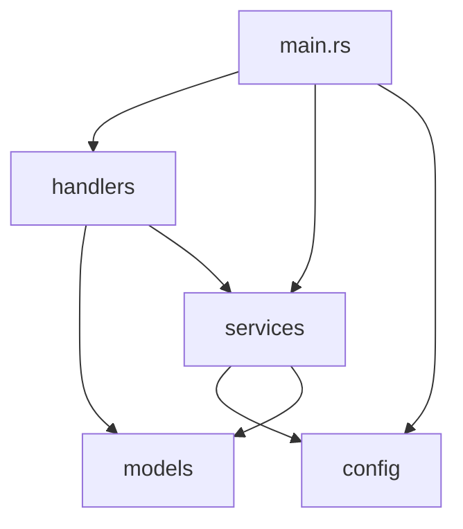

# Архитектура приложения

Этот документ подробно описывает архитектурные решения, принятые при разработке демонстрационного проекта.

## 1. Общая структура

Приложение построено на основе модульной архитектуры, где каждый компонент имеет четко определенную зону ответственности. Это соответствует принципу **Single Responsibility Principle (SRP)** и делает код более читаемым, тестируемым и поддерживаемым.



- **`main.rs`**: Точка входа. Отвечает за инициализацию: загрузку конфигурации, создание сервисов и запуск Rocket.
- **`config`**: Модуль для загрузки и управления конфигурацией из `config.toml` и переменных окружения.
- **`models`**: Содержит структуры данных (DTO - Data Transfer Objects), используемые для сериализации/десериализации JSON в запросах и ответах API.
- **`services`**: Содержит бизнес-логику. В данном случае - логику взаимодействия с AI-сервисами.
- **`handlers`**: Обработчики эндпоинтов Rocket. Они принимают запросы, вызывают соответствующие сервисы и возвращают ответы.

## 2. Паттерн "Сервисный слой" и "Трейт-объект"

Ключевым архитектурным решением является использование **сервисного слоя**, абстрагированного с помощью трейта `AiService`.

### Трейт `AiService`

```rust
#[async_trait]
pub trait AiService: Send + Sync {
    async fn ask(&self, question: &str) -> Result<String, AiServiceError>;
    fn name(&self) -> &str;
}
```

Этот трейт определяет общий интерфейс для любого AI-сервиса. Использование `async_trait` позволяет использовать `async` функции в трейтах.

### Реализации

1.  **`GigaChatService`**: Реальная реализация, которая взаимодействует с GigaChat API через библиотеку `gigalib`.
2.  **`MockAiService`**: Заглушка, которая возвращает предопределенные ответы. Не требует подключения к сети и используется для тестирования и разработки.

### Преимущества подхода

- **Гибкость**: Мы можем легко добавить новую реализацию (например, для другого AI-сервиса), не изменяя код обработчиков.
- **Тестируемость**: В тестах мы всегда используем `MockAiService`, что делает тесты быстрыми, предсказуемыми и независимыми от внешних сервисов.
- **Разделение ответственности**: Обработчики (`handlers`) не знают о деталях реализации AI-сервиса. Они просто вызывают метод `ask`.

## 3. Управление зависимостями и состоянием

Для внедрения зависимостей (таких как конфигурация и AI-сервис) в обработчики используется механизм управления состоянием Rocket.

В `main.rs` мы инициализируем объекты и передаем их в Rocket:

```rust
rocket::custom(figment)
    .manage(config)       // Добавляем AppConfig в состояние
    .manage(ai_service)   // Добавляем Box<dyn AiService> в состояние
    // ...
```

Затем в обработчиках мы можем получить доступ к этим объектам:

```rust
#[post("/ask", ...)]
pub async fn ask(
    request: Json<AskRequest>,
    ai_service: &State<Box<dyn AiService>>,
) -> ... {
    // ...
}
```

Это пример **Dependency Injection (DI)**, который позволяет сделать компоненты более независимыми друг от друга.

## 4. Конфигурация

Конфигурация управляется библиотекой `config`. Она позволяет:

- Загружать настройки из файла (`config.toml`).
- Переопределять их переменными окружения (например, `APP_SERVER_PORT=8001`).
- Использовать файл `.env` для локальной разработки.

Это обеспечивает гибкость настройки приложения для разных окружений (разработка, тестирование, продакшн) без необходимости перекомпиляции.

## 5. Обработка ошибок

- **В сервисах**: Используется кастомный enum `AiServiceError` с `thiserror` для создания информативных ошибок.
- **В обработчиках**: Ошибки преобразуются в `Json<ErrorResponse>` и возвращаются клиенту с соответствующим HTTP-статусом.
- **В Rocket**: Используются `catchers` для обработки стандартных ошибок Rocket (404, 500, 422), что позволяет возвращать пользователю единообразные сообщения об ошибках в формате JSON.

## 6. Условная компиляция (Features)

Для того чтобы сделать интеграцию с `gigalib` опциональной, используются **фичи (features)** Cargo.

В `Cargo.toml`:

```toml
[dependencies]
gigalib = { version = "0.1.3", optional = true }

[features]
default = ["gigachat"]
gigachat = ["dep:gigalib"]
mock = []
```

Это позволяет скомпилировать проект без `gigalib` командой:

```bash
cargo build --no-default-features --features mock
```

В коде условная компиляция используется для включения/выключения `GigaChatService`:

```rust
#[cfg(feature = "gigachat")]
pub struct GigaChatService { ... }
```

Это продвинутая техника, которая делает приложение еще более гибким и позволяет уменьшить размер бинарного файла, если реальная интеграция с GigaChat не нужна.
